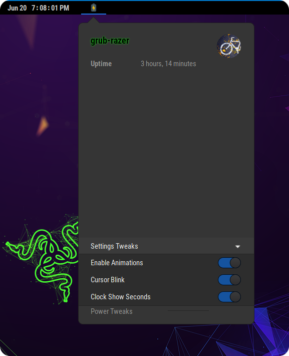

# power-tweaks

Power Tweaks a gnome shell extension that allows you to tweak certain settings right from the settings UI.
Some of these settings are set automagically when the system switches from battery to AC and vice versa.

